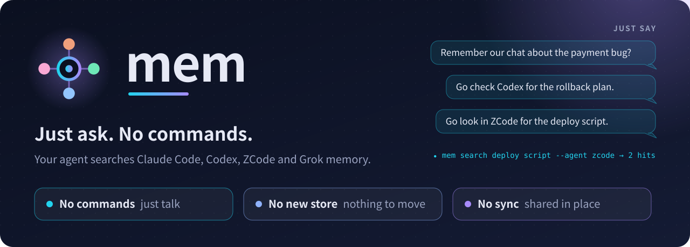
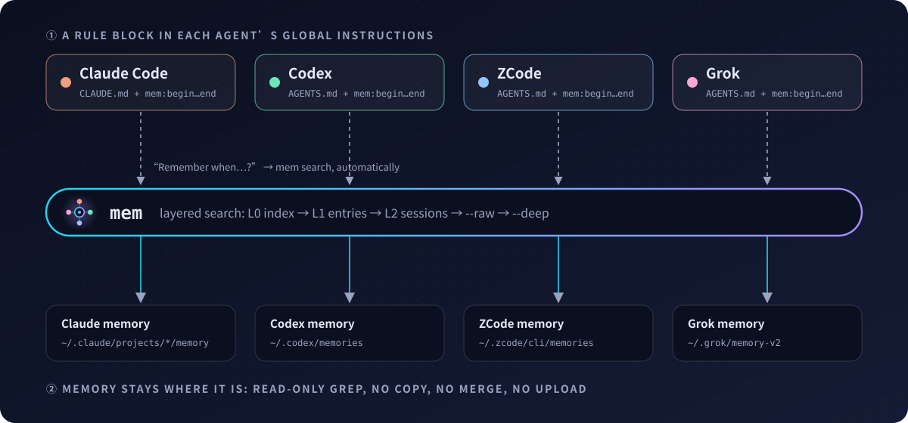

<p align="center">
  
</p>

<p align="center">
  <a href="LICENSE"></a>
  
  
  
  
</p>

<p align="center">
  <b>English</b> · <a href="README.zh-CN.md">简体中文</a>
</p>

---

Claude Code, Codex, ZCode and Grok each build up memory about how you work: your habits, past decisions, the bugs that bit you. But they can't see each other's. Decide something in Codex, and you explain it all over again in Claude.

Memory tools usually fix this by handing you three chores: **call** them with special commands, **store** memory in their format, and **sync** it between agents. mem removes all three.

- **No commands.** Just ask: "Remember our chat about the payment bug?", "Go check Codex for the rollback plan." Your agent runs `mem` by itself.
- **No new store.** Every agent keeps writing memory the way it already does. Nothing to migrate or re-save.
- **No sync.** mem reads each agent's memory where it lives, so it's always current.

<p align="center">
  
</p>

## Just talk

After setup you never type `mem` yourself. The rule block teaches each agent to treat questions about the past as memory lookups:

| You say | Your agent does |
|---|---|
| "Do you remember our chat about the payment bug?" | `mem search payment bug` across every agent |
| "Go check Codex for the rollback plan." | `mem search rollback plan --agent codex` |
| "Go look in ZCode for the deploy script." | `mem search deploy script --agent zcode` |
| "What did we decide on the cache last time?" | `mem search cache`, then reads the matching section |
| "Have we hit this error before?" | `mem search <error text>` |
| "What has Grok been working on this week?" | `mem recent --days 7 --agent grok` |

It is also told never to answer "I can't see previous conversations" when the answer might be in another agent's memory.

## Why mem

| Principle | What it means |
|---|---|
| **Invisible** | Agents call mem on their own when you talk about the past. |
| **Nothing moves** | Memory stays in each agent's own folder. No copying, no merging, no migration. |
| **Read-only** | mem only greps. It never writes to any memory store. |
| **No server** | One Python file. No daemon, no database, no network, no account. |
| **Owner decides** | mem refuses to guess which agents to share. It asks you first. |
| **Easy to undo** | Every change sits between `mem:begin` / `mem:end` markers. Delete them and it's gone. |

## Quick start

**Windows:** use the [native Windows guide](windows/README.md) for Claude Code and Codex. The commands below are for macOS/Linux.

### Option A: let your AI install it (recommended)

Open [`INSTALL-PROMPT.md`](INSTALL-PROMPT.md), copy the prompt, and paste it into any AI coding agent. It checks your environment, asks which agents to share, shows you exactly which files it will touch, and waits for your OK before writing anything. About five minutes.

### Option B: by hand

**Requirements:** macOS or Linux, Python 3.8+, and [ripgrep](https://github.com/BurntSushi/ripgrep) (`brew install ripgrep` / `sudo apt install ripgrep`).

**1. Put `mem` on your PATH**

```bash
mkdir -p ~/bin && curl -fsSL https://raw.githubusercontent.com/wyiky/mem-kit/main/mem -o ~/bin/mem && chmod +x ~/bin/mem
```

If `mem --help` says `command not found`, add `export PATH="$HOME/bin:$PATH"` to `~/.zshrc` or `~/.bashrc` and open a new terminal.

**2. Tell it which agents to share**

```bash
mem init --agents claude,codex,zcode,grok
```

Built-in names: `claude` `codex` `zcode` `grok` `opencode`. For anything else, use `--path name=/path/to/memory`. An agent with no memory folder can still join. It reads the others and contributes nothing.

**3. Teach each agent to use it**

```bash
mem install           # dry run: shows what would change
mem install --apply   # write it
```

This appends a rule block to each agent's global instructions file (existing content untouched; re-running replaces the block and never duplicates it). It also adds a `mem` allowlist entry for Claude Code and Grok, so they don't prompt every time. Restart any open agent sessions afterwards.

## How it works

<p align="center">
  
</p>

`mem search` goes from coarse to fine:

| Layer | What it searches | When |
|---|---|---|
| L0 index | Each store's index (`MEMORY.md`, `memory_summary.md`) | always |
| L1 entries | Individual memory files | always |
| L2 sessions | Codex session summaries | always, if Codex is shared |
| L3 raw | Codex raw memories | `--raw` |
| L4 evidence | Codex activity logs | `--deep` |

## Commands

| Command | What it does |
|---|---|
| `mem map` | Overview of every store, measured live |
| `mem search deploy rollback` | Search all stores, grouped by layer |
| `mem search rollback --agent codex` | Search only the named agent(s), comma-separated |
| `mem show <path> --section 'Heading'` | Read one section; big files return an outline |
| `mem recent --days 7 [--agent grok] [word]` | Memory changed recently |
| `mem snapshot` | Commit git-backed stores |
| `mem --version` | Print version |

Output follows your system language (English or Chinese). Override with `MEM_LANG=en` or `MEM_LANG=zh`.

## Cross-language aliases (optional)

If some agents write memory in English and you ask in another language, you'll miss hits. Create `~/.config/mem/aliases.tsv`, one tab-separated line per term:

```
deploy	release|ship|上线
database	db|postgres|数据库
```

Now `mem search deploy` also searches for release, ship and 上线. This file is personal. Don't ship it with mem.

## FAQ

**Will it change my memory?**
No. mem is read-only. `install` only edits each agent's global instructions file, and only the part between `mem:begin` and `mem:end`.

**How is this different from a memory server or MCP memory tool?**
Those give you a new place to store memory: you run a service, move memory into it, and call it on purpose. mem adds no new store and no new habit. It searches the memory your agents already keep, where they already keep it, whenever you ask about the past.

**My agent still didn't check memory.**
The rule raises the odds; it can't force the agent every time. Just tell it: "check mem first".

**No hits?**
Try a synonym or another language. If you mix languages, add aliases. Two rounds of 0 hits means it isn't in memory.

**Can I edit Codex's memory files?**
Don't. Codex regenerates its index files wholesale, and your edits will be lost.

## Uninstall

1. Delete everything between `<!-- mem:begin -->` and `<!-- mem:end -->` in each agent's instructions file
2. Remove the `mem` allowlist entry from Claude Code / Grok settings, if added
3. `rm ~/bin/mem && rm -r ~/.config/mem`

No memory data is touched.

## Limitations

- Plain text matching, no relevance ranking.
- Rules make agents more likely to check memory, not certain to.
- The original `mem` CLI supports macOS and Linux. A separate [Windows bridge](windows/README.md) supports Claude Code and Codex on Windows.

## License

[MIT](LICENSE)
