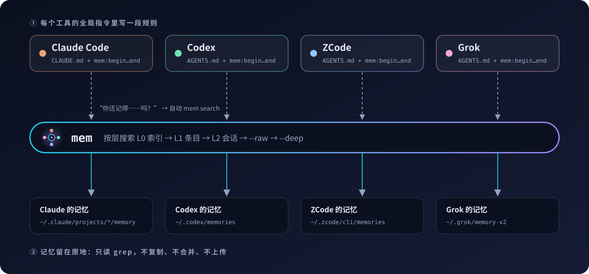

<p align="center">
  
</p>

<p align="center">
  <a href="LICENSE"></a>
  
  
  
  
</p>

<p align="center">
  <a href="README.md">English</a> · <b>简体中文</b>
</p>

---

Claude Code、Codex、ZCode、Grok 用久了，各自都会记下你的习惯、做过的决定、踩过的坑。可它们互相看不见：在 Codex 里定下的事，换到 Claude 就得重讲一遍。

市面上的记忆工具想解决这个问题，往往会多塞给你三件麻烦事：**调用**要记专门的命令，**存储**要按它的格式重新存一遍，**共享**要在工具之间来回同步。mem 把这三件事都省掉了：

- **零调用**：直接说「你还记得我上周那个支付 bug 的对话吗？」「你去 Codex 那边找一下回滚方案」，AI 会自己去跑 `mem`。
- **零存储**：每个工具照常记自己的记忆，不迁移，不重新存。
- **零同步**：mem 在原地读取各工具的记忆，看到的永远是最新的。

<p align="center">
  
</p>

## 直接说就行

装好以后，你不需要自己敲 `mem`。写进各工具的规则会教它们：凡是问到过去的事，就当成查记忆。

| 你说 | AI 会做 |
|---|---|
| 「你还记得我之前那个支付 bug 的对话吗？」 | `mem search 支付 bug`，搜遍所有工具 |
| 「你去 Codex 那边找一下回滚方案」 | `mem search 回滚方案 --agent codex` |
| 「你去 ZCode 那边找一下部署脚本」 | `mem search 部署脚本 --agent zcode` |
| 「缓存那个事我们上次怎么定的？」 | `mem search 缓存`，再读命中的那一节 |
| 「这个报错以前遇到过吗？」 | `mem search 报错内容` |
| 「Grok 这周都在忙什么？」 | `mem recent --days 7 --agent grok` |

规则还明确要求：答案可能在别的工具的记忆里时，不许回答「我看不到之前的对话」。

## 为什么用 mem

| 特点 | 说明 |
|---|---|
| **无感调用** | 你一说起过去的事，AI 就自己去查，不用记任何命令。 |
| **记忆不搬家** | 记忆还在各工具自己的目录里。不复制、不合并、不迁移。 |
| **只读** | mem 只做检索，从不写入任何记忆库。 |
| **零服务** | 一个 Python 文件。不起后台进程，不要数据库，不联网，不注册账号。 |
| **主人说了算** | 共享哪些工具由你定，mem 不会自己猜，没配置时先问你。 |
| **一删就干净** | 所有改动都在 `mem:begin` 到 `mem:end` 标记之间，删掉就还原。 |

## 快速开始

**Windows：** Claude Code 与 Codex 请看 [Windows 原生安装说明](windows/README.zh-CN.md)。下面的命令用于 macOS/Linux。

### 方式一：让 AI 帮你装（推荐）

打开 [`INSTALL-PROMPT.zh-CN.md`](INSTALL-PROMPT.zh-CN.md)，把里面那段话复制给任意一个 AI 编码工具。它会检查环境，问你要共享哪几个工具，把要改的文件逐一列给你看，你同意之后才写入。大约五分钟。

### 方式二：自己动手

**准备**：macOS 或 Linux，装有 Python 3.8+ 和 [ripgrep](https://github.com/BurntSushi/ripgrep)（`brew install ripgrep` 或 `sudo apt install ripgrep`）。

**① 放进 PATH**

```bash
mkdir -p ~/bin && curl -fsSL https://raw.githubusercontent.com/wyiky/mem-kit/main/mem -o ~/bin/mem && chmod +x ~/bin/mem
```

运行 `mem --help`，如果提示 `command not found`，把 `export PATH="$HOME/bin:$PATH"` 加进 `~/.zshrc` 或 `~/.bashrc`，然后重开终端。

**② 登记要共享的工具**

```bash
mem init --agents claude,codex,zcode,grok
```

内置认识的名字：`claude` `codex` `zcode` `grok` `opencode`。其他工具用 `--path 名字=记忆目录` 指定。没有记忆目录的工具也可以加入，它能读别人的记忆，只是自己不贡献。

**③ 教会每个工具用它**

```bash
mem install           # 预演：只列出会改哪些文件
mem install --apply   # 真正写入
```

它会在每个工具的全局指令文件末尾追加一段规则：原有内容不动，重复运行只替换这一段，不会叠加。Claude Code 和 Grok 还会各加一条 `mem` 命令白名单，免得每次调用都弹窗。装完后，把已经开着的 AI 会话重开一次。

## 工作原理

<p align="center">
  
</p>

`mem search` 从粗到细，逐层往下搜：

| 层 | 搜什么 | 什么时候搜 |
|---|---|---|
| L0 索引 | 各库的总目录（`MEMORY.md`、`memory_summary.md`） | 默认 |
| L1 条目 | 每一条具体记忆 | 默认 |
| L2 会话 | Codex 的会话摘要 | 默认，共享了 Codex 才有 |
| L3 原始 | Codex 的原始记忆 | 加 `--raw` |
| L4 证据 | Codex 的活动流 | 加 `--deep` |

## 命令一览

| 命令 | 作用 |
|---|---|
| `mem map` | 各记忆库现状，数字每次现算 |
| `mem search 部署 回滚` | 一次搜遍所有库，按层分组 |
| `mem search 回滚 --agent codex` | 只搜指定的工具，多个用逗号隔开 |
| `mem show <路径> --section '标题'` | 只读某一节；大文件默认只给大纲 |
| `mem recent --days 7 [--agent grok] [词]` | 最近改过的记忆 |
| `mem snapshot` | 给带 git 的记忆库打快照 |
| `mem --version` | 查看版本 |

输出语言跟随系统（中文或英文），也可以用 `MEM_LANG=zh` 或 `MEM_LANG=en` 指定。

## 中英别名（可选）

有些工具的记忆主要是英文写的，你用中文搜会漏掉。可以建一个 `~/.config/mem/aliases.tsv`，每行一条，用 Tab 分隔：

```
部署	deploy|发布|上线
数据库	database|db|postgres
```

之后搜「部署」，会自动连 deploy、发布、上线一起搜。这个文件是你的私有配置，把 mem 分享给别人时不要带上。

## 常见问题

**会不会改动我的记忆？**
不会。mem 只读。`install` 只改各工具的全局指令文件，而且只动 `mem:begin` 到 `mem:end` 之间那一段。

**和各种记忆服务、MCP 记忆工具有什么区别？**
那些工具提供一个新的存储位置：你要跑一个服务，把记忆搬进去，还得专门去调用它。mem 不新建存储，也不用你养成新习惯：你一问起过去的事，它就在原地检索你的 AI 已经记下的东西。

**AI 还是没去查记忆？**
规则只能提高它主动去查的概率，没法保证每次都查。直接跟它说「先用 mem 搜一下」就行。

**搜不到？**
换个近义词或者换种语言再搜。如果经常中英混用，就加上面说的别名。两轮都是 0 命中，说明记忆里确实没有。

**能直接改 Codex 的记忆文件吗？**
不要。Codex 会整体重新生成自己的索引文件，你改的内容会丢。

## 卸载

1. 删掉各工具指令文件里 `<!-- mem:begin -->` 到 `<!-- mem:end -->` 之间的内容
2. 删掉 Claude Code 或 Grok 配置里的 `mem` 白名单（如果加过）
3. `rm ~/bin/mem && rm -r ~/.config/mem`

不会碰任何记忆数据。

## 限制

- 只做文本匹配，没有相关度排序。
- 规则能提高 AI 主动查记忆的概率，不能保证每次都查。
- 原版 `mem` 命令支持 macOS/Linux；另有面向 Claude Code 与 Codex 的 [Windows 版](windows/README.zh-CN.md)。

## 许可证

[MIT](LICENSE)
